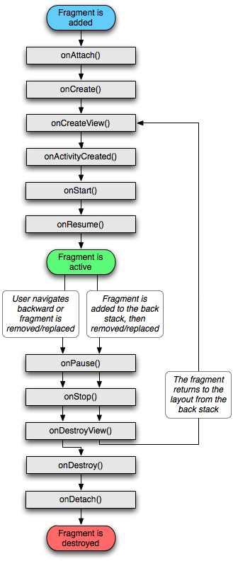

# Fragment

Following are important points about fragment:
* A fragment has its own layout and its own behaviour with its own life cycle callbacks.
* You can add or remove fragments in an activity while the activity is running.
* You can combine multiple fragments in a single activity to build a multi-pane UI.
* A fragment can be used in multiple activities.
* Fragment life cycle is closely related to the life cycle of its host activity which means when the activity is paused, all the fragments available in the activity will also be stopped.
* A fragment can implement a behaviour that has no user interface component.
* Fragments were added to the Android API in Honeycomb version of Android which API version 11.

## Fragment Lifecycle


Here is the list of methods which you can to override in your fragment class:
* `onAttach()` The fragment instance is associated with an activity instance.The fragment and the activity is not fully initialized. Typically you get in this method a reference to the activity which uses the fragment for further initialization work.
* `onCreate()` The system calls this method when creating the fragment. You should initialize essential components of the fragment that you want to retain when the fragment is paused or stopped, then resumed.
* `onCreateView()` The system calls this callback when it's time for the fragment to draw its user interface for the first time. To draw a UI for your fragment, you must return a View component from this method that is the root of your fragment's layout. You can return null if the fragment does not provide a UI.
* `onActivityCreated()` The onActivityCreated() is called after the onCreateView() method when the host activity is created. Activity and fragment instance have been created as well as the view hierarchy of the activity. At this point, view can be accessed with the findViewById() method. example. In this method you can instantiate objects which require a Context object.
* `onStart()` The onStart() method is called once the fragment gets visible.
* `onResume()` Fragment becomes active.
* `onPause()` The system calls this method as the first indication that the user is leaving the fragment. This is usually where you should commit any changes that should be persisted beyond the current user session.
* `onStop()` Fragment going to be stopped by calling onStop().
* `onDestroyView()` Fragment view will destroy after call this method.
* `onDestroy()` onDestroy() called to do final clean up of the fragment's state but Not guaranteed to be called by the Android platform.

* LayoutInflater is in `onCreateView()` method
* Binding views with Java object usually happens in `onViewCreated()` method

## Bottom Navigation Bar Fragment Based
### Step 1 - Setup bottom navigation layout
* Right click the `res` folder and create a menu xml layout file
* The root node should be menu
* In this case, our xml layout file is named bottom_navigation.xml

Once the menu layout file is created, we'll add three items into the layout file, indicate that we have three items in our bottom navigation bar.
* Home
* Favorites
* Search
``` xml
<?xml version="1.0" encoding="utf-8"?>
<menu xmlns:android="http://schemas.android.com/apk/res/android">

    <item
        android:id="@+id/nav_home"
        android:icon="@drawable/ic_baseline_home_24"
        android:title="Home" />

    <item
        android:id="@+id/nav_favorites"
        android:icon="@drawable/ic_baseline_favorite_24"
        android:title="Favorites" />

    <item
        android:id="@+id/nav_search"
        android:icon="@drawable/ic_baseline_search_24"
        android:title="Search" />

</menu>
```

### Step 2 - Setup main activity layout
* Go to activity_main.xml
* Change Constraint layout to Relative layout
* Add BottomNavigationView to the main layout
``` xml
<com.google.android.material.bottomnavigation.BottomNavigationView
        android:id="@+id/bottom_navigation"
        android:layout_width="match_parent"
        android:layout_height="wrap_content"
        android:layout_alignParentBottom="true"
        app:menu="@menu/bottom_navigation"
        android:background="?android:attr/windowBackground"/>
```
* Set width to match parent, set height to wrap content
* Set `android:layout_alignParentBottom` to true, so that the navigation bar is showing on the bottom of the screen
* Set menu property to the menu layout file that we just created in step 1
* Set `android:background` to `windowBackground`, so that the background of the navigation bar matches the theme of the App, not transparent.

Now, add a FrameLayout to the top layout
``` xml
<FrameLayout
        android:id="@+id/fragment_container"
        android:layout_width="match_parent"
        android:layout_height="match_parent"
        android:layout_above="@id/bottom_navigation"/>
```
* set `android:layout_above` to `bottom_naviagtion`, in order that it displays above the navigation bar

### Step 3 - Create corrsponding fragment layout
``` xml
<!-- fragment_home.xml -->
<?xml version="1.0" encoding="utf-8"?>
<RelativeLayout xmlns:android="http://schemas.android.com/apk/res/android"
    android:layout_width="match_parent"
    android:layout_height="match_parent"
    android:background="@android:color/holo_blue_light">

    <TextView
        android:layout_width="wrap_content"
        android:layout_height="wrap_content"
        android:text="Home Fragment"
        android:textSize="30sp"
        android:layout_centerInParent="true"/>

</RelativeLayout>
```
``` xml
<!-- fragment_search.xml -->
<?xml version="1.0" encoding="utf-8"?>
<RelativeLayout xmlns:android="http://schemas.android.com/apk/res/android"
    android:layout_width="match_parent"
    android:layout_height="match_parent"
    android:background="@android:color/holo_red_light">

    <TextView
        android:layout_width="wrap_content"
        android:layout_height="wrap_content"
        android:text="Search Fragment"
        android:textSize="30sp"
        android:layout_centerInParent="true"/>

</RelativeLayout>
```
``` xml
<!-- fragment_favorites.xml -->
<?xml version="1.0" encoding="utf-8"?>
<RelativeLayout xmlns:android="http://schemas.android.com/apk/res/android"
    android:layout_width="match_parent"
    android:layout_height="match_parent"
    android:background="@android:color/holo_orange_light">

    <TextView
        android:layout_width="wrap_content"
        android:layout_height="wrap_content"
        android:text="Favorites Fragment"
        android:textSize="30sp"
        android:layout_centerInParent="true"/>

</RelativeLayout>
```

### Step 4 - Create corresponding Java class to the xml layout files
* Extends Fragment base class
* Override `onCreateView()` method
* Inside `onCreateView()` method, inflate corresponding xml layout
* An example for `fragment_home`
``` Java
public class HomeFragment extends Fragment {
    @Nullable
    @Override
    public View onCreateView(@NonNull LayoutInflater inflater, @Nullable ViewGroup container, @Nullable Bundle savedInstanceState) {
        return inflater.inflate(R.layout.fragment_home, container, false);
    }
}
```

### Step 5 - Setup navigation item selected listener
* Go to `MainActivity` class -> `onCreate()` method
``` java
public class MainActivity extends AppCompatActivity {

    @Override
    protected void onCreate(Bundle savedInstanceState) {
        super.onCreate(savedInstanceState);
        setContentView(R.layout.activity_main);

        // Create and config navigation item selected listerner
        BottomNavigationView.OnNavigationItemSelectedListener navListener = new BottomNavigationView.OnNavigationItemSelectedListener() {
            @Override
            public boolean onNavigationItemSelected(@NonNull MenuItem item) {
                Fragment selectedFragment = null;

                switch (item.getItemId()) {
                    case R.id.nav_home:
                        selectedFragment = new HomeFragment();
                        break;
                    case R.id.nav_favorites:
                        selectedFragment = new FavoritesFragment();
                        break;
                    case R.id.nav_search:
                        selectedFragment = new SearchFragment();
                        break;
                }
                getSupportFragmentManager().beginTransaction().replace(R.id.fragment_container, selectedFragment).commit();

                return true;
            }
        };

        // Set navigation item selected listener
        BottomNavigationView bottomNavigationView = findViewById(R.id.bottom_navigation);
        bottomNavigationView.setOnNavigationItemSelectedListener(navListener);
        
        // when App launched, automaticly switch to home fragment
        getSupportFragmentManager().beginTransaction().replace(R.id.fragment_container, new HomeFragment()).commit();
    }
}
```
* In order to make the App displays the Home Fragment at the start, we need to set the fragment page manually on Actvity main class
